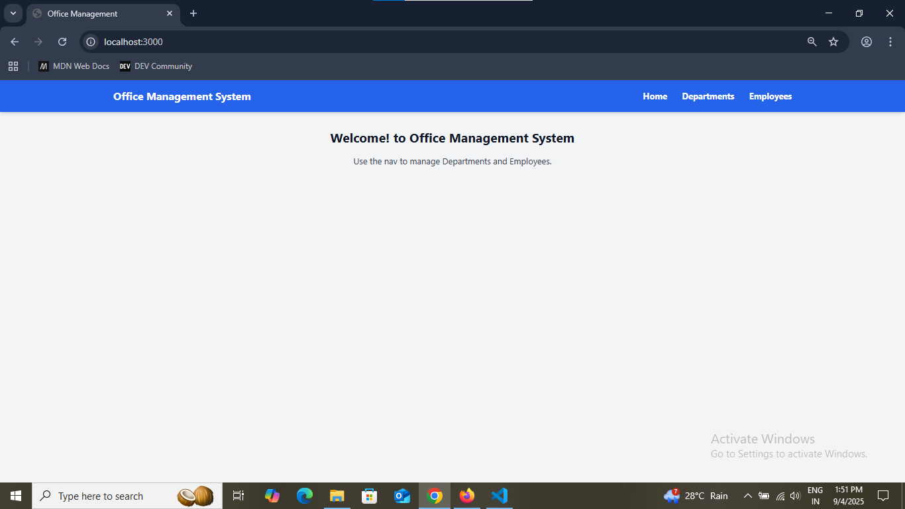
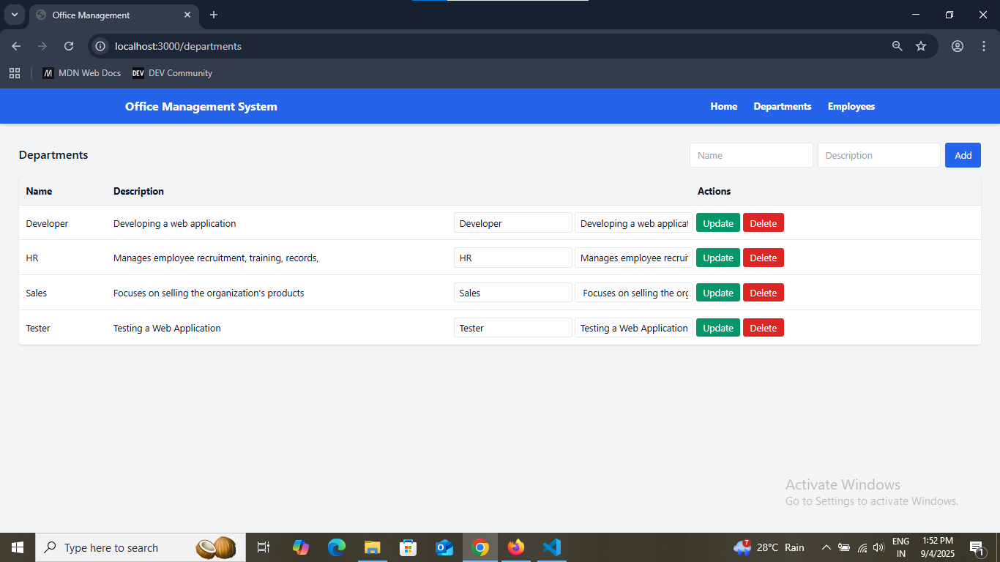
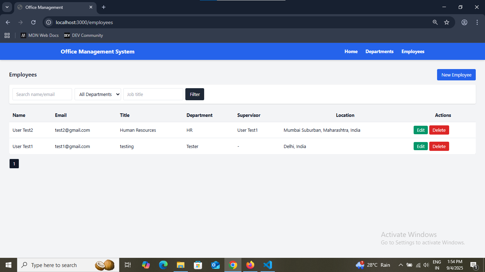

# Office Management System (Node.js, Express, MongoDB)

A simple Office Management System demonstrating:
- Department & Employee CRUD
- Employee ↔ Department relation
- Employee self-referencing supervisor
- REST API with pagination, search, and filters
- EJS views (TailwindCSS)
- Dynamic Country → State → City using CountriesNow API

## Quick Start

```bash
git clone https://github.com/Jaswant-Yadav/Office-Management-Task.git
cd Office-Management-Task
cp .env.example .env   # or create .env manually
npm install
npm run dev
```

Create `.env`:
```
PORT=3000
MONGODB_URI=url
```

Visit:
- Web UI: `http://localhost:3000`
- Employees UI: `http://localhost:3000/employees`
- Departments UI: `http://localhost:3000/departments`
- API root: `http://localhost:3000/api`

## Screenshots






